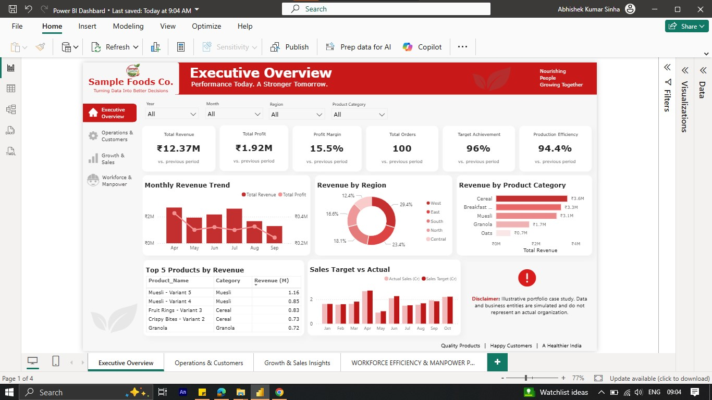
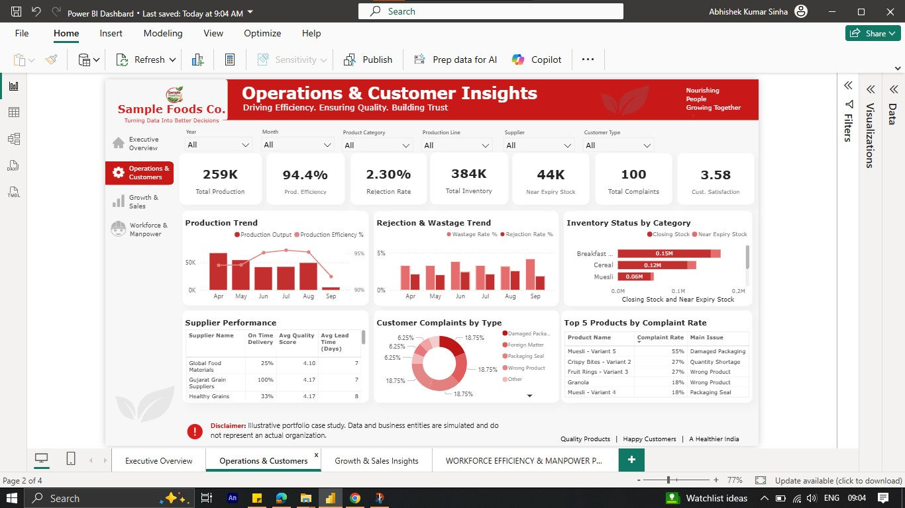
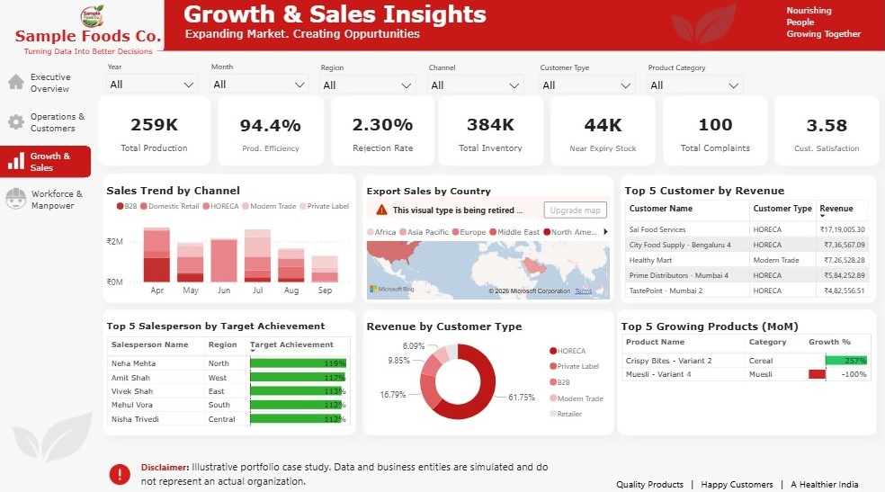
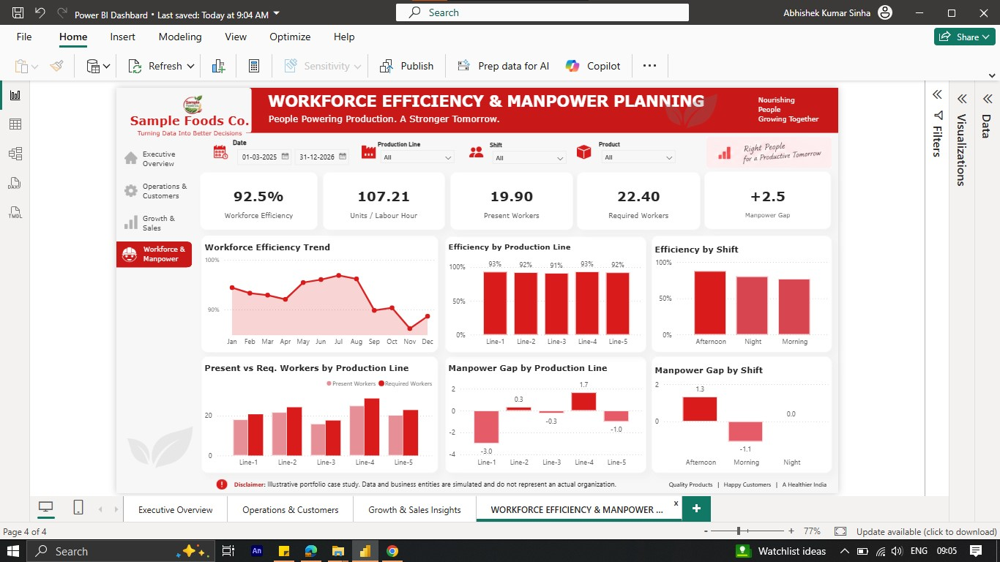

# Food Manufacturing Business Intelligence & Analytics

> **End-to-end Power BI portfolio case study | Sales • Operations • Growth • Workforce**

An integrated Business Intelligence solution demonstrating how business data can be transformed into management-ready insights across sales, operations, production, inventory, customer performance, and workforce planning.

> ⚠️ **Portfolio Disclaimer:** This is an illustrative portfolio case study. The datasets, transactions, business figures, and business entities are simulated and do not represent an actual organization or confidential company data.

## 📌 Project Overview

The project combines four connected Power BI modules:

| Module | Business Focus |
|---|---|
| 🏢 Executive Overview | Overall business health and management KPIs |
| ⚙️ Operations & Customer Insights | Production, quality, inventory, suppliers, and customer issues |
| 📈 Growth & Sales Insights | Sales channels, customers, exports, targets, and product growth |
| 👥 Workforce & Manpower Planning | Workforce productivity, efficiency, and manpower requirements |

**Data → Cleaning → Standardization → Data Model → DAX → Analysis → Visualization → Insights → Decision Support**

## 🎯 Business Objectives

The solution is designed to help management understand:

- Overall revenue, profit, orders, targets, and production performance
- Product, regional, customer, and channel performance
- Production efficiency, rejection, wastage, and inventory risks
- Supplier performance and customer complaints
- Workforce productivity across production lines and shifts
- Potential manpower shortages or surpluses
- Estimated manpower required for planned production

# 📊 Dashboard Modules

## 1. Executive Overview

**KPIs:** Total Revenue, Total Profit, Profit Margin, Total Orders, Target Achievement, Production Efficiency.

**Analysis:** Monthly Revenue & Profit Trend, Revenue by Region, Revenue by Product Category, Top Products by Revenue, Sales Target vs Actual.

## 2. Operations & Customer Insights

**KPIs:** Total Production, Production Efficiency, Rejection Rate, Total Inventory, Near-Expiry Stock, Customer Complaints, Customer Satisfaction.

**Analysis:** Production Trend, Rejection & Wastage Trend, Inventory Status, Supplier Performance, Customer Complaints, Products by Complaint Rate.

## 3. Growth & Sales Insights

**Analysis:** Sales Trend by Channel, Export Sales by Country, Top Customers by Revenue, Top Salespeople by Target Achievement, Revenue by Customer Type, Top Growing Products (MoM).

## 4. Workforce Efficiency & Manpower Planning

**KPIs:** Workforce Efficiency, Units per Labour Hour, Present Workers, Required Workers, Manpower Gap.

**Analysis:** Workforce Efficiency Trend, Efficiency by Production Line, Efficiency by Shift, Present vs Required Workers, Manpower Gap by Line and Shift.

# 🧮 Workforce Manpower Planning Methodology

**Labour Hours**
```text
Present Workers × Production Hours
```

**Units per Labour Hour**
```text
Accepted Good Quantity ÷ Labour Hours
```

**Workforce Efficiency**
```text
Actual Productivity ÷ Benchmark Productivity × 100
```

**Required Labour Hours**
```text
Planned Good Quantity ÷ Benchmark Productivity
```

**Effective Hours per Worker**
```text
Shift Hours − Planned Downtime
```

**Required Workers**
```text
Required Labour Hours ÷ Effective Hours per Worker
```

**Manpower Gap**
```text
Required Workers − Present Workers
```

The prototype uses a historical **P75 productivity benchmark** as a practical high-performing benchmark. With real data, this should be validated with operational stakeholders and refined where sufficient observations exist.

> The model is a decision-support tool, not an automatic hiring or workforce-reduction system. Actual planning should also consider skills, machine capacity, changeovers, maintenance, product complexity, minimum staffing, and operational constraints.

# 🛠️ Tools & Technologies

- **Power BI** — dashboard development, data modeling, DAX, interactive reporting
- **Microsoft Excel** — data preparation, validation, calculations, manpower planning
- **SQL** — data querying and analytical workflows
- **Python** — data analysis and preprocessing
- **DAX** — KPI and business metric calculations

# 🔄 Analytical Workflow

### 1. Data Collection
Illustrative datasets cover products, customers, sales, production, inventory, procurement, quality, complaints, exports, targets, and workforce.

### 2. Cleaning & Standardization
Dates, categories, identifiers, and analytical fields were standardized and validated.

### 3. Data Modeling
The Power BI model uses fact-style datasets, master/reference data, a date dimension, and relevant relationships.

### 4. KPI Development
DAX measures were created for revenue, profit, margin, efficiency, productivity, rejection, workforce, and manpower metrics.

### 5. Visualization
Interactive slicers, KPI cards, trends, comparisons, and tables provide management-focused analysis.

### 6. Decision Support
The framework moves from:

**What happened? → Where? → Why? → What action should be considered?**

# 🖼️ Dashboard Preview

## Executive Overview
Management-level view of revenue, profit, targets, orders, and production efficiency.



## Operations & Customer Insights
Production, quality, inventory, supplier, and customer performance analysis.



## Growth & Sales Insights
Sales channels, customers, exports, salespeople, and product growth analysis.



## Workforce Efficiency & Manpower Planning
Workforce productivity and data-driven manpower planning.



# 💡 Business Insight Areas

### Sales
Revenue drivers, regions, channels, customers, target achievement, and product growth.

### Operations
Production efficiency, rejection, wastage, inventory risk, and supplier performance.

### Customer
Complaint types, complaint rates, customer satisfaction, and affected products.

### Workforce
Productivity per labour hour, line and shift efficiency, present vs required workers, and manpower gaps.

# 🚨 Future Executive Exception Monitoring

A natural extension is an **Executive Exception Monitoring System** where predefined business rules identify important events such as:

- High-value financial transactions
- Significant sales deviations
- Production efficiency below threshold
- Critical inventory levels
- High rejection or wastage
- Significant manpower shortages

Potential architecture:

```text
ERP / Business Systems
        ↓
Central Data Source
        ↓
Power BI Dataset
        ↓
Executive Dashboard
        ↓
Exception / Threshold Logic
        ↓
Email / Teams / Notification
        ↓
Responsible Executive
```

# 🚀 Future Improvements

- ERP/database integration
- Automated data refresh
- Executive exception monitoring
- Threshold-based alerts
- Power Automate notifications
- Production capacity analysis
- Product-line-shift workforce benchmarks
- Sales and production forecasting
- Automated management reporting
- Transaction-level drill-through
- Role-based access

# 📁 Repository Structure

```text
Food-Manufacturing-Bi-Analytics/
│
├── README.md
├── Data/
├── Excel/
│   └── Workforce_Manpower_Planning_Model.xlsx
├── PowerBI/
│   └── Food_Manufacturing_BI_Dashboard.pbix
├── DAX/
│   └── Measures.md
├── Screenshots/
│   ├── 01_Executive_Overview.png
│   ├── 02_Operations_Customer_Insights.png
│   ├── 03_Growth_Sales_Insights.png
│   └── 04_Workforce_Manpower_Planning.png
└── Documentation/
    ├── Methodology.md
    └── Business_Insights.md
```

# ⚠️ Limitations & Disclaimer

This is a **portfolio case study using simulated/illustrative data**. Numerical results, company information, transactions, customers, suppliers, and business entities are not intended to represent actual company performance.

The workforce benchmark and manpower calculations are prototype assumptions and should be validated against real historical data, operational standards, and business rules before real-world use.

# 👤 Author

## Abhishek Sinha

**MSc Data Science | Data Analytics | Power BI | SQL | Excel | Python**

Interested in turning business data into clear insights, practical analytics solutions, and better decision-making.

**Project Focus:** Business Intelligence • Data Analytics • Power BI • Manufacturing Analytics • Sales Analytics • Operations Analytics • Workforce Analytics
